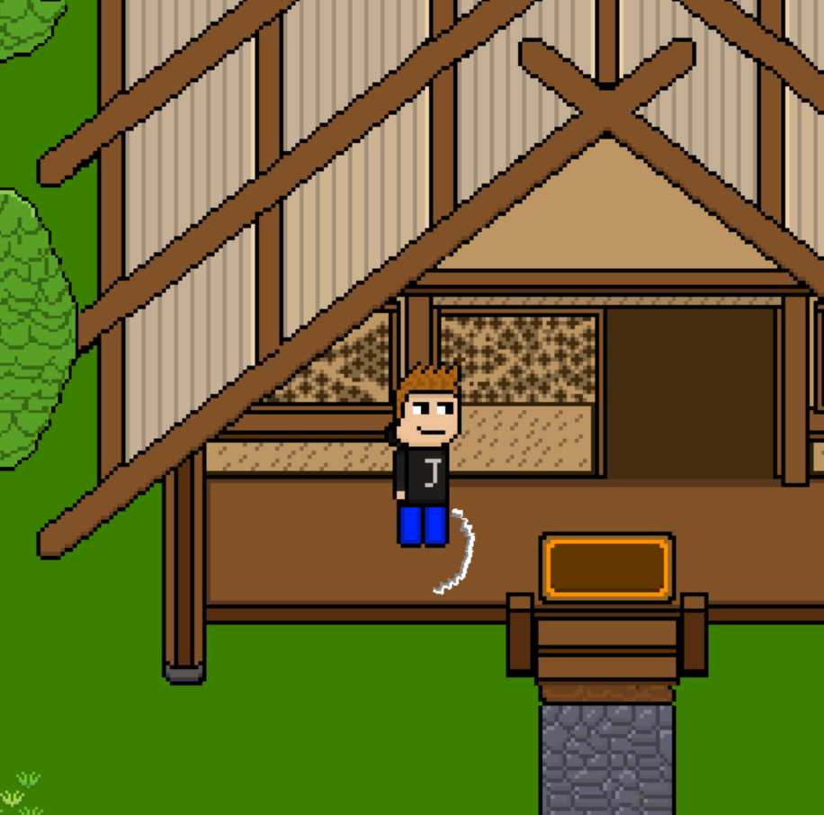

<div align="center">

<p>Game available over <a href="https://ibox-studios.itch.io/johns-adventure-chapter-1">here.</a></p>
<br/>


</div>

# John's Adventures : Chapter 1

Welcome to game! The project started *seriously* at early August 2021 and ended in March 2022. 
The games philosophy was introduced by our Story Writer. Whose idea was to find someone to bring his idea to life for a dear friend.
Then one based student and his friends decided to make it come true by creating its first chapter.

<br> 
Welcome to John's Adventure! A project entirely written in python and pygame.


## Usage
To run the game, first install all the required packages using :
```shell
python3 -m pip install -r requirements.txt
```
Then run the game using :
```shell
python3 main.py
```

---
## Credits

- Programming: [Marios Papazogloy](https://github.com/mariospapaz) and [Theophile Aumont](https://github.com/fkS124)
 
- Story Telling: Manos Danezis

- Music Designer: Thanos Pallis
 
---
## Custom License
In short, code is allowed to be seen/edited, but the assets/music are not. <br> 
Please refrain from getting a copyright.  
